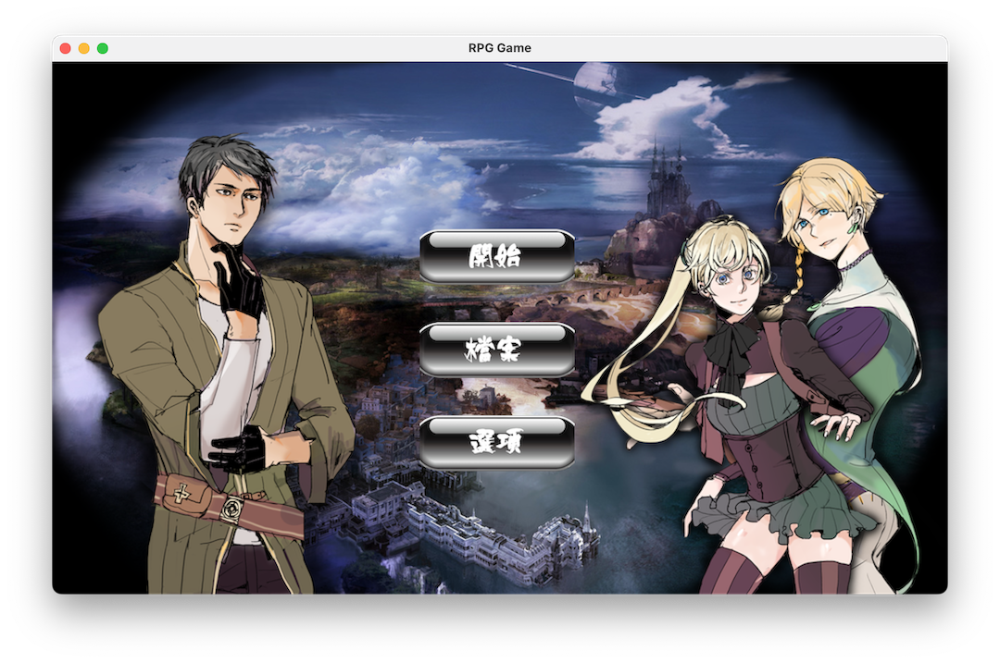
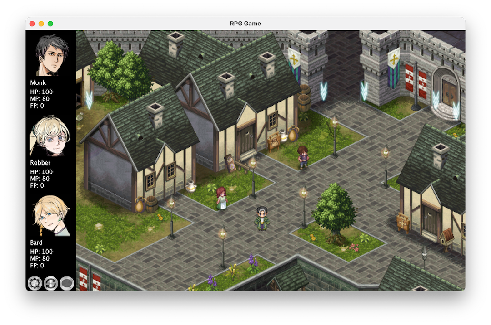

# Light-RPG

Welcome to "Light-RPG"! This is a simple GUI role-playing game where you'll control three characters (Robber, Monk, and Bard) on a 10-day adventure.

## Install Java Runtime Environment

Before you start playing, you need to make sure you have the Java Runtime Environment (JRE) installed. If you haven't already installed Java, you can follow these steps:

1. Visit the [Oracle Java Official Website](https://www.oracle.com/java/technologies/javase-downloads.html) or [OpenJDK](https://openjdk.java.net/) and download the Java SE Development Kit (JDK) suitable for your operating system.

2. Follow the installation wizard's instructions to install the JDK.

3. After the installation is complete, you can verify the Java installation by running the following command in your terminal or command prompt:

   ```bash
   java -version
   ```

   If the installation was successful, you'll see information about your Java version.

## Play the Game

1. Download and unzip this repository.

2. Double click the **RPG.jar** file or open your terminal and navigate to the directory. Run the following command in the terminal to start the game:

   ```bash
   java -jar RPG.jar
   ```

3. The game will start, and you'll begin controlling the three characters on their adventure. Follow the game rules and try to achieve the best outcome within the 10-day timeframe.



## Game Setup

- Each day consumes one unit of food.
- All characters have individual HP (Health Points), MP (Magic Points), and FP (Fatigue Points).
- Activities can reduce a character's HP, and when HP reaches zero, the character becomes unconscious.
- MP is used for various actions; characters need sufficient MP to perform actions.
- FP determines how many actions each character can take each day.
- At the start, all characters have 100 HP, 80 MP, 0 FP, and no food, coins, or drinks.

## Game Actions

In "Light-RPG," you can control your characters to perform the following actions:

- Move: Explore the map and advance to new locations.
- Rest: Rest the entire party for a day to recover HP and MP.
- Character-specific Actions: Each character has unique special actions, e.g., Robber's Robbery, Monk's Healing, and Bard's Music.
- Buy Food: Purchase food using coins to sustain your party.
- Adventure: Adventures may lead to finding treasures, battles, or other unexpected events.
- Build Huts: Spend coins to build huts, serving as your base of operations.



## Game Rules

- The game spans 10 days, and you must control the characters and perform actions every day.
- Days end when a character's FP reaches or exceeds 100 or when you choose to rest.
- Actions consume food, so choose your actions carefully to ensure your party's survival.
- Characters can earn coins, buy food, rob the rich, heal teammates, or play music to regain MP.
- After the game ends, your performance will be evaluated, and different titles will be awarded to your party.

## Disclaimer

- If you encounter any issues during the game or have questions, feel free to check the repository for additional information.
- This game uses some online resources. If you have concerns about copyright infringement, please contact the author.
